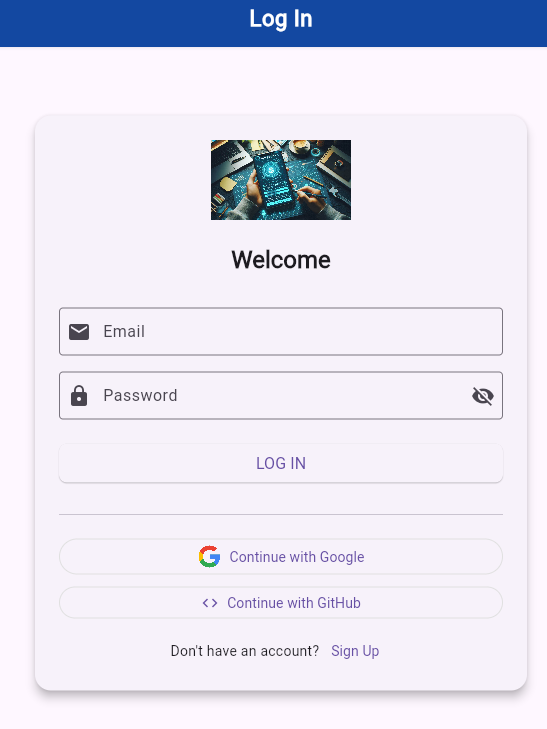
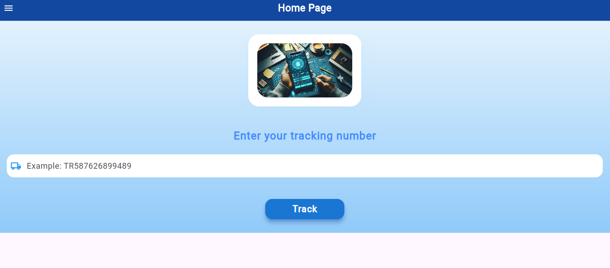
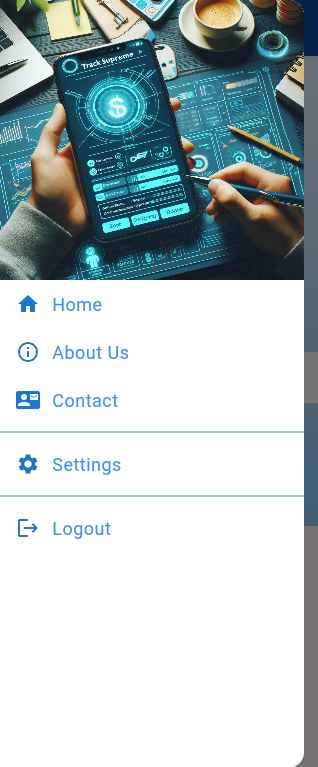
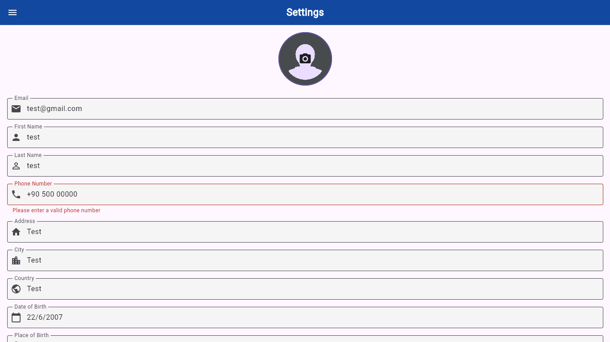
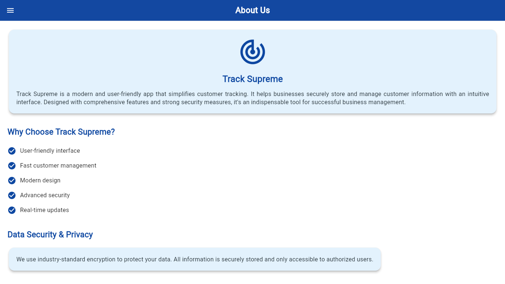
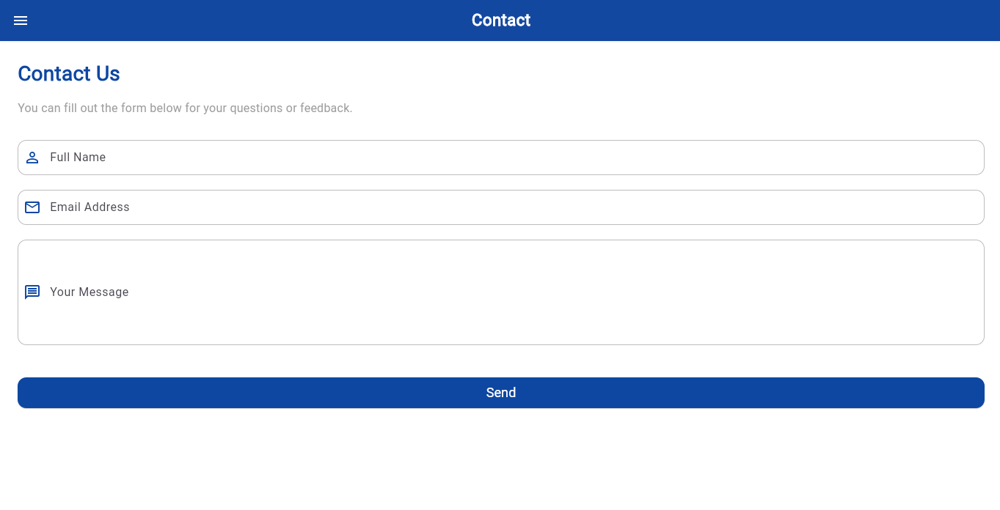

# Track Supreme 

**Müşteri Takip Programı**  
Email, Google ve GitHub ile Giriş/Kayıt, Supabase ve Firebase ile Veri Saklama, Çoklu Platform Desteği (Android, iOS, Windows, Web)  


---

##  Proje Özeti

Track Supreme, kullanıcıların ürün/kargo takip numaralarını girerek anlık durumlarını görebildiği, profil bilgilerini yönetebildiği gelişmiş bir müşteri takip uygulamasıdır.  
Güçlü kimlik doğrulama, geniş veri saklama altyapısı ve çoklu platform uyumu ile modern müşteri deneyimi sunar.

---

##  Sayfa Bazlı Detaylar

### 1. Giriş / Kayıt Sayfası  
- Email, Google, GitHub ile güvenli oturum açma.  
- Kullanıcı bilgileri Firebase Auth ile doğrulanır.   



---

### 2. Ana Sayfa (Home)  
- Takip numarası giriş alanı.  
- Kargo/ürün durumu gerçek zamanlı gösterim.  
- GitHub’dan çekilen JSON dosyasına bağlı güncel kargo bilgisi.  



---

### 3. Drawer Menü  
- Kolay gezinme için özel Drawer.  
- Profil resmi ve kullanıcı adı gösterimi.  
- Hızlı erişim: Ana Sayfa, Ayarlar, Hakkımızda, İletişim ve Çıkış.  



---

### 4. Ayarlar (Settings)  
- Profil bilgileri düzenleme: isim, soyisim, doğum tarihi, profil fotoğrafı.  
- Veriler Firebase ve Supabase’e senkronize edilir.  



---

### 5. Hakkımızda (About Us)  
- Proje ve ekip hakkında detaylı bilgi.  
- İletişim bilgileri.  



---

### 6. İletişim (Contact)  
- Kullanıcı geri bildirimi için form.  
- E-posta ve telefon bilgileri.  



---

##  Kullanılan Teknolojiler

| Teknoloji         | Rolü                                   |
|-------------------|---------------------------------------|
| Flutter           | Cross-platform UI framework            |
| Firebase Auth     | Kimlik doğrulama ve kullanıcı yönetimi|
| Supabase          | Veri tabanı, kullanıcı ve takip verileri |
| SQLite            | Offline veri saklama                    |
| SharedPreferences | Yerel uygulama ayarları                 |
| GitHub API        | Kargo bilgisi JSON dosyasının çekilmesi |

---

## 👥 Katkıda Bulunanlar

| İsim                        | Katkı Detayları |
|-----------------------------|----------------|
| **Mohamed Abdulla Elfaituri** | 🔧 Uygulamanın tam geliştirilmesi, <br> 🔐 Firebase Authentication kurulumu ve tüm giriş metodları (Email, Google, GitHub), <br> 🧾 Firebase Firestore ile kullanıcı bilgileri yönetimi, <br> 🛢️ Supabase veritabanı yapısı ve bağlantıları, <br> 💾 SharedPreferences ile yerel veri saklama, <br> 📦 SQLite ile offline destek entegrasyonu, <br> 🌐 API'den JSON veri çekme ve gösterme (GitHub üzerinden), <br> 🖼️ UI ekranlarının hazırlanması, AppBar/Drawer yapısı, <br> 🛡️ Güvenlik ve kullanıcı verilerinin senkronizasyonu |
| **IMAD ALSHEIKH BAKRI** | 💡 UI testleri ve öneriler, <br> 📱 UX geliştirmeye yardımcı fikirler, <br> 🧪 Fonksiyonel testlerde destek, <br> 🎨 Görsel düzenleme katkısı |


## 📁 Dosya Yapısı

```plaintext
/lib
  ├── main.dart
  ├── firebase_options.dart
  ├── public/
        │   ├── assets/
                 └── images/
                        ├── track_supreme_logo.png
                        ├── login_screen.png
                        ├── home_screen.png
                        ├── custom_drawer.png
                        ├── settings_screen.png
                        ├── about_us.png
                        ├── contact_screen.png
                        ├── google_icon.png
                        ├── github_icon.png
                        ├── user_avatar_placeholder.png
                        ├── calendar_icon.png
                        ├── email_icon.png
                        ├── phone_icon.png
                        ├── github_logo.png
                        ├── google_logo.png
      ├── drawer/
          │   ├── custom_app_bar.dart
          │   ├── Drawer_Widget.dart
      ├── models/
          │   ├── user_profile.dart
      ├── screens/
          │   ├── home_screen.dart
          │   ├── login_screen.dart
          │   ├── settings_screen.dart
          │   ├── about_us.dart
          │   ├── contact.dart
          │   ├── signup_screen.dart
          │   ├── track_cargo_screen.dart
      ├── services/
          │   ├── auth_service.dart
          │   ├── cargo_service.dart
          │   ├── shared_preferences_service.dart
          │   ├── sqlite_helper.dart
          │   ├── supabase_service.dart
